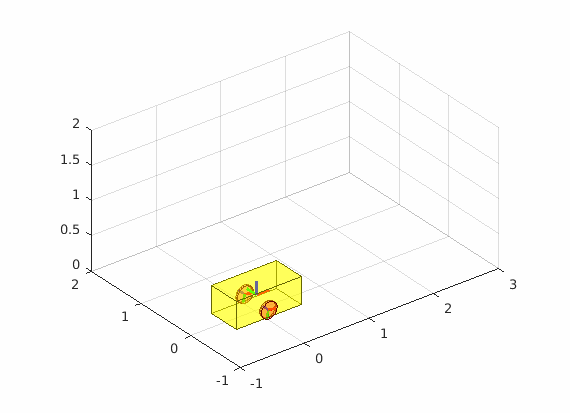
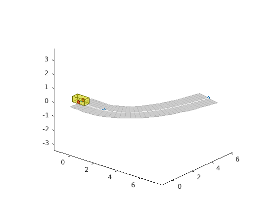

# Meow
A Matlab Simulation Repo, now focus on robot visualization and Navigation planning.

## Contents

```sh
.
├── meow_startup.m      # load lib path
├── doc                 # demo picture
├── examples            # some demo and feature test
├── third               # third lib
├── utils               # create common object
└── visualization       # draw object on current figure
```

## Demo
- Differential wheeled robot

<p align="center">
    
</p>

- robot on the road

<p align="center">
    
</p>

## Refs
- https://github.com/star2dust/Robotics-Toolbox
