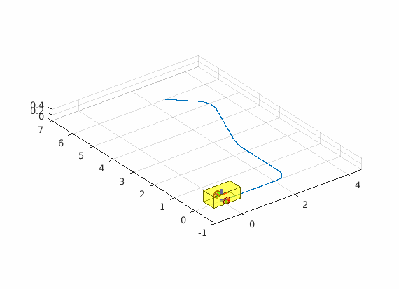
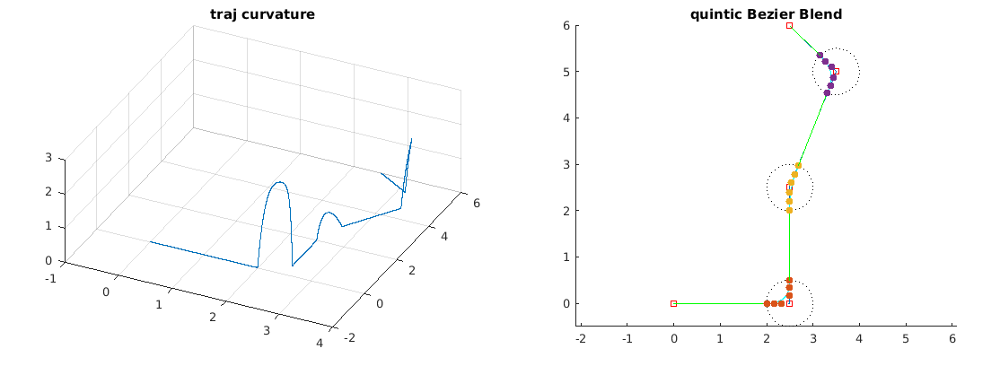
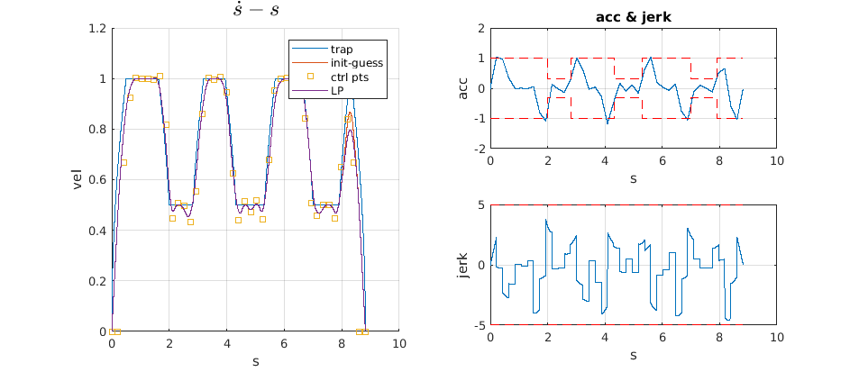
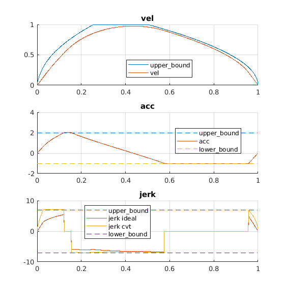

# Meow
A Matlab Simulation Repo, now focus on robot visualization and Navigation planning.

## Contents

```sh
.
├── meow_startup.m      # load lib path
├── doc                 # demo picture
├── examples            # some demo and feature test
├── third               # third lib
├── utils               # create common object
└── visualization       # draw object on current figure
```

## Demo
- [Differential wheeled robot](examples/demo_Kinematic.m)

<p align="center">
    
</p>

- [robot on the road](examples/demo_createRobot.m)

<p align="center">
    
</p>

- [Quintic Bezier Blend](examples/demo_path_blend.m)

<p align="center">
    
</p>
<p align="center">
    
</p>

- [Time optimal velocity planning using Linear Programming in the form of a second order B-Spline](examples/demo_LP_vel.m)

<p align="center">
    
</p>


- [Motion Velocity Smoother](examples/demo_jerk_smooth.m)

autoware 代码中将论文中的 SOCP 问题简化为 QP 问题；虽然只考虑了 smooth 和 IoD，但合理整定参数也可以基本实现较好的光滑速度曲线。

<p align="center">
    
</p>


## Refs
- https://github.com/star2dust/Robotics-Toolbox
