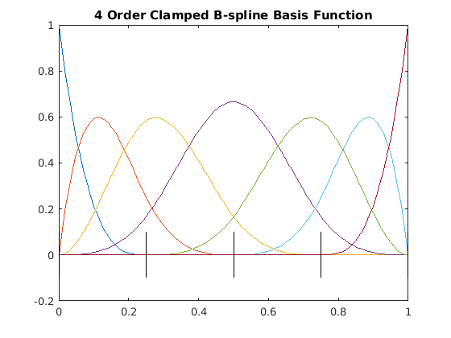
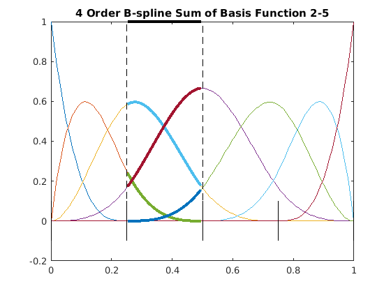
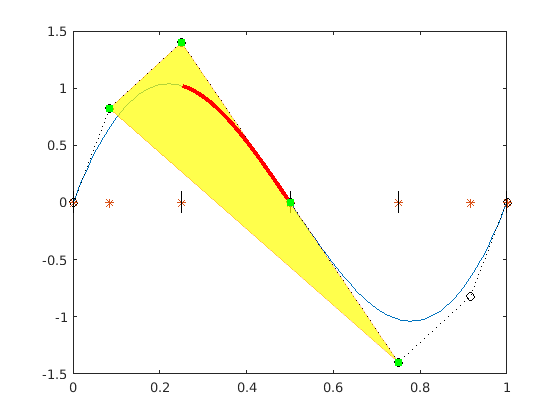

## Summary
MATLAB core provide the cubic splines functionality

## B-splines
An `order` `k` B-spline is formed by several pieces of polynomials of `degree`  `k-1`, with at most  continuity at the breakpoints.

Given `n+1` control points 

A `knot` vector defines the set of non-descending breakpoints

<p align="center">

</p>

<p align="center">

</p>

`Nodes`  are the averages of the knots

<p align="center">

</p>

### Code

`demo_spline.m`

```m
k = 4;  % degree = 3
n = 6;  % control points size 7
m = 10; % knots vector size 11

knots = [0 0 0 0 0.25 0.5 0.75 1 1 1 1];    % clamped uniform
```

- basis function size: `m+1-k`
<p align="center">
    
</p>

- at each point, the sum of basis functions is equal to 1
<p align="center">
    
</p>

- Convex Hull: a span lies within the convex hull of the `k` control points that affect it.
<p align="center">
    
</p>

## Details

|function | details|
|--|--|
|`fnval`  |evaluate|
|`fnder`  |differentiate|
|`fndir`  |Directional derivative of function|
|`fnint`  |integrate|
|`fnmin`  |minimize|
|`fnzeros`|find zeros of|
|`fnplt`  |plot|
|`fnrfn`  |refine|
|`fnxtr`  |Extrapolate spline|
|`augknt` | providing boundary knots and also controlling the multiplicity of interior knots|
|`brk2knt`| supplying a knot sequence with specified multiplicities|
|`aptknt` | providing a knot sequence for a spline space of given order that is suitable for interpolation at given data sites|
|`optknt` | providing an optimal knot sequence for interpolation at given sites|
|`newknt` | a knot sequence perhaps more suitable for the function to be approximated|
|`aveknt` | Provide knot averages|


# Refs
- https://web.mit.edu/hyperbook/Patrikalakis-Maekawa-Cho/node15.html